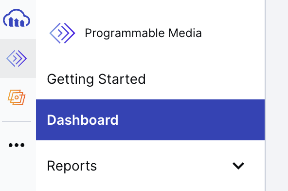

## Deployment


### Image Handler

**Important note:** These steps might not be necessary if you're solely interested in local deployment. During local development, Djangos built-in system can manage your images. However, for Heroku an image handler is crucial to avoid broken images

**If you don't have an image handler already, I recommend [Cloudinary](https://cloudinary.com/). Create an account [here](https://cloudinary.com/users/register_free)**

<u>After</u>  creating an account, follow these steps:

**Step 1:** Navigate to the dashboard in the navbar and click "Dashboard".


**Step 2:** Copy your "API Environment variable".


*Everything is done in Cloudinary. Now, save the API Environment variable you copied somewhere safe.*

---

### Database Deployment

**I used [elephantssql](https://www.elephantsql.com/). You can create an account [here](https://customer.elephantsql.com/signup)**

<u>After</u>  creating an account, follow these steps:

**Step 1:** Click "Create New Instance".


**Step 2:** Select a name. Use the Free plan. Then click "Select region".


**Step 3:** Select a data center near you. Then click "Review".


**Step 4:** Confirm your instance and click "Create instance".


**Step 5:** Click on your instance name.


**Step 6:** Copy the URL.


*Everything is done in ElephantSQL. Now, save the URL you copied somewhere safe.*

---

## Local Deployment

**Step 1:** Clone this repository.

```git clone https://github.com/bianca9901/django-project.git```

**Step 2:** Go to ```project_restaurant``` root directory.

```cd project_restaurant```

**Step 3:** Create a virtual environment.

* ```python3 -m venv venv```

* ```source venv/bin/activate```

**Step 4:** Install all dependencies.

```pip install -r requirements.txt```

**Step 5:** Create an ```env.py``` file.

```touch env.py```

**Step 6:** Add the following lines to ```env.py```:
* ```import os```
* ```os.environ["SECRET_KEY"]``` = Your secret key.
* ```os.environ["DEBUG"]``` = "True" or "False" depending on whether you are in development or production.
* ```os.environ["ALLOWED_HOSTS"]``` = Your domain name.
* ```os.environ["DATABASE_URL"]``` = Your database url.
* ```os.environ["CLOUDINARY_URL"]``` = Your API Environment variable.

**Step 7:** Migrate:
1. ```pip manage.py makemigrations```
2. ```pip manage.py migrate```


*Local Deployment done! I hope it went well.*

---

## Heroku Deployment
**If you don't have a Heroku account. Create a account [here](https://cloudinary.com/users/register_free)**

<u>After</u>  creating an account, follow these steps:

**Step 1:** Click "Create New App".


**Step 2:** Select a name and your region and click "Create app."


**Step 3:** In your newly created app's dashboard, navigate to the "Settings" tab.


**Step 4:** Click on "Reveal Config Vars" and add the following Config Vars:


**Config Vars:** 

* ALLOWED_HOSTS = your Heroku domain name *in the key field.*

* DATABASE_URL = your database URL *in the key field.*

* SECRET_KEY = your secret key *in the key field.*

* CLOUDINARY_URL = your API Environment variable *in the key field.*

* DEBUG = True during development, False during production *in the key field.*

* DISABLE_COLLECTSTATIC = 1 during development, remove in production *in the key field.*


**Step 6:** Navigate to the "Deploy" tab.


**Step 7:** Connect to your GitHub account.


**Step 8:** Connect to your GitHub repository.


**Step 9:** Scroll down to "Manual Deploy" and click on "Deploy Branch".


**Step 10:** Click "View" to see your app.


*Heroku Deployment done! I hope it went well.*

---