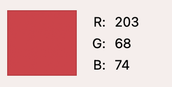

# The Django Restaurant

## About

#### Django is a fictional restaurant that not only offers delicious food but also engaging events for its users to partake in.

**Django Restaurant Main Features:**

* **Event reservations:** Explore upcoming events on the 'Events' page and choose the ones that best match your interests and secure your spot with ease.

* **Easy reservation process:** The intuitive reservation process allows you to pick your desired event, select the number of spots you need, and make a reservation for yourself and your companions.

* **Personalized Events dashboard:** Keep track of your upcoming plans effortlessly with the 'My Events' page. Here, you can find all the details you need. Need to change your plans? No problem, do it directly from your dashboard.

* **Menu exploration:** Explore the 'Menu' page to see the drinks and dishes served. The Menu goes by the admin dashboard so the staff will always update the page with the latest drinks and foods for you to see.

* **Share your experience:** Your feedback is valuable! You can always leave a review to share your thoughts and help us improve. Don’t worry if you want to edit or delete your review(s) later, you can always access and manage them.

---

## Pages

### Home Page

**Presents the restaurant's offerings through text and image slides.**

### About Us Page

**Displays image of staff and text about the restaurant's philosophy.**

### Menu Page

**Displays food and drink offerings with descriptions and prices.**

### Events Page

**Displays upcoming events with date, time, description, and the available spots left.**

### Event Reservation Page

**Displays a concise recap about the selected event, a numberbox for users to specify the number of companions and a submit button.**

### My Events Page
**Shows authenticated user’s their upcoming events and cancelation and editing buttons.**

### Reviews Page
**Displays all guest reviews.**

### Review Form
**Displays textbox that allows users to write and submit their review.**

### Edit Review Form
**Displays prepopulated textbox with previously written review text.**

*ps. login, logout, registration, error404 and error500 templates are not included. Please visit the website link here.*

---

## Design

### The design choice:
I aimed to give the restaurant website a modern and sleek style, which drove my font and background color choices, that is grey, off-white, white, and gold.

With the modern feel as the base, I also wanted to give the restaurant a warm, and joyful ambiance. Therefore, the images were carefully selected to create an atmosphere that aligns with the restaurant's philosophy and key features.

When it comes to the messages and buttons, I wanted them to catch the eye. That's why I opted for attention-grabbing colors that also aligns with its purpose, yellow for info etc.

Typography played a vital role to give the right feel. I aimed for a cool and hip style that resonates with the targeted audience.

As for the logo and the signed "-Django Team" text pieces, I aspired to select a Google font that portrays a handwritten style, adding a personal touch.

### Colors used:
**For the overall design I used grey, off-white, white, and gold:**

RGB(110, 117, 124)

RGB(248, 248, 248)

RGB(255, 255, 255)

RGB(190, 194, 133)

**For messages and buttons I used 2 nyances of red, 2 nyances of green, and yellow:**

RGB(209, 77, 70)

RGB(203, 68, 74)

RGB(116, 197, 120)

RGB(169, 235, 176)

RGB(255, 255, 132)

### Typography: 

**I used [Google Fonts](https://fonts.google.com/) for all text:**

For the logo and the signed "-Django Team" text pieces I used Zeyada Regular 400.

For the navbar and headlines I used Caveat Bold 700.

For the paragraphs I used Open Sans Medium 500 Italic.

---

## Testing

Please visit [this link](TESTING.md) to find test-related documentation.

---

## Deployment

Please visit [this link](DEPLOYMENT.md) to find deployment-related documentation.

---

## Bugs

### Solved Bugs

**Bootstrap Modal Issue:** I wanted to use a modal for defensive programming. I Googled Bootstrap modals, and without thinking much more about it. I used the syntax provided in the Bootstrap documentation. I then tested my website but the modal would not pop up, causing a lot of confusion.

**Solution:** After doing some research I found [this](https://stackoverflow.com/questions/17142790/bootstrap-modal-not-working-at-all) question from someone encountering the same issue as I, asking for help. And someone had an answer that I figured could be the issue.

The issue stemmed from the fact that I used Bootstrap 5 in my base.html and when I initially Googled Bootstrap modals unfortunately the first result was the documentation for Bootstrap 4 which was the syntax I was trying to use in my code. This syntax did indeed not have the **bs** attribute as mentioned in the Stack Overflow answer.

It was my fault that I had not checked the version of the modal. Good news is that
when I changed to v.5 for the modal documentation in Bootstrap, (the version of Bootstrap that I used in my base.html) The modal would work as expected.

This situation served as a valuable lesson in staying up-to-date with framework changes.

### Unsolved Bugs
**Edit Reservation Issue:** I encountered an unresolved bug related to the Reservation feature, and I'd like to share my experience with it. Unfortunately, due to time constraints during the project, I wasn't able to fully implement all aspects of CRUD functionality in this area.

The specific issue is the process of editing reservations. The original intention was for the reservation edit form to be prepopulated with the user's existing reservation details. This included accounting for the number of spots reserved and making sure they were correctly updated in the available spots count. For instance, if there were initially 10 available spots and a user reserved 5 spots, there should have been 5 spots remaining. If the user then attempted to edit their reservation by increasing the number of spots, the intention was to restore the originally reserved spots back to the available count (so that it's back to 10 in this example).
This step was crucial to ensure a proper user experience. For instance, if a user had initially booked 5 spots but then decided to edit the reservation to increase the number of spots to 6, without restoring their originally reserved spots, the system would incorrectly show the event as fully booked even though there were spots available.

Despite multiple days attempting, I struggled to accurately incorporate this aspect of CRUD functionality. The challenge stemmed from various factors, including potential changes in the available spots due to other users reserving spots in the same event, making it difficult to track and manage the correct spot count for editing reservations.

Now, I had to make a tough decision. The only solution left was to cancel a user's existing reservation and guide them back to the event reservation form, where they could see the updated available spots count and make a totally new booking. While this solution definetely is not ideal, I made sure to include clear and important messages throughout the  edit reservation process to guide users and provide them with the best experience possible.

I feel deeply dissapointed that I couldn't fully address this issue within the given timeframe.

---

## Features left to implement

* Implement the "U" in CRUD for reservations, as mentioned in bugs section [here](#unsolved-bugs).

* Allow authenticated users to filter the "Reviews" page to see their previous reviews.

* Implement pagination for the "Events" and "Reviews" pages.

* Ensure consistent image sizes on the "Events" page to enhance UX.

* Add a favicon

----

## Technologies Used

### Languages
* [HTML](https://developer.mozilla.org/en-US/docs/Web/HTML): was used for structuring the website's content.

* [CSS](https://developer.mozilla.org/en-US/docs/Web/CSS): was used to style the website.

* [Python](https://www.python.org/): was used for the logic.

* [JavaScript](https://developer.mozilla.org/en-US/docs/Web/JavaScript): was used to disable a button.

### Frameworks and Libraries

* [Django](https://www.djangoproject.com/): was used for building the web application.

* [Bootstrap](https://getbootstrap.com/): was used for responsive design and layout.

### Databases

* [SQLite](https://www.sqlite.org/index.html): was used as a development database.

* [PostgreSQL](https://www.postgresql.org/): was the database used to store all the data.

## Other Technologies
* [Cloudinary](https://cloudinary.com/): was used for efficient image management and delivery.

* [Github](https://github.com/): was used for repository hosting and version control.

* [Git](https://git-scm.com/): was used for version control.

* [GitPod](gitpod.io): was used for writing and editing code.

* [Heroku](https://id.heroku.com/login): was used to deploy the project.

* [Pip3](https://pypi.org/project/pip/): was the package manager used to install the dependencies.

* [Gunicorn](https://gunicorn.org/): was the web server used to run the website.

* [Psycopg](https://pypi.org/project/psycopg2/): was used as the database adapter for Python.

* [Django Allauth](https://django-allauth.readthedocs.io/en/latest/): was used for authentication, registration, and account management.

* [Pillow](https://pypi.org/project/Pillow/): was used for image processing.

* [Google Fonts](https://fonts.google.com/): was used for the typography.

* [Font Awesome](https://fontawesome.com): was used for the social media icons.

---

## Credits

### Inspiration and Help:

 [These](https://www.youtube.com/watch?v=HHx3tTQWUx0&list=PLCC34OHNcOtqW9BJmgQPPzUpJ8hl49AGy) Youtube videos served as a helper to get started with my event views and the application for members.

 [This](https://www.youtube.com/@technologyit5133) Youtube channel showed me general tips and tricks about Django that I applied.

 [This](https://stackoverflow.com/questions/17142790/bootstrap-modal-not-working-at-all) question in Stack Overflow helped me overcome the issue I had with Bootstrap.

 [This](https://github.com/IuliiaKonovalova/e-commerce/blob/main/DEPLOYMENT.md) documentation was used as a template for my DEPLOYMENT.md.

### Media:

All images were sourced from [Pexels](https://www.pexels.com).

**Carousel Images:**

* [Bar Image](https://www.pexels.com/photo/person-pouring-wine-in-a-jigger-making-a-cocktail-drink-15081737/)

* [Food Image](https://www.pexels.com/sv-se/foto/mat-restaurang-hander-manniskor-1310777/)

* [Restaurant Interior Image](https://www.pexels.com/photo/empty-dining-sets-at-the-eatery-2313037/)

* [Friends Image](https://www.pexels.com/photo/friends-drinking-whisky-and-cocktails-in-a-bar-16374147/)

* [Man playing guitar Image](https://www.pexels.com/photo/photo-of-man-playing-guitar-4054461/)

**About Us Image:**

* [Group photo image](https://www.pexels.com/sv-se/foto/manniskor-kvinna-vanner-man-6150584/)

**Events Images:**

* [Chess image](https://www.pexels.com/photo/men-playing-chess-on-the-wooden-table-11434528/)

* [Karaoki image](https://www.pexels.com/photo/man-singing-1238943/)

* [Billiard image](https://www.pexels.com/photo/people-playing-billiard-5055267/)

* [Monopoly](https://www.pexels.com/photo/game-figures-on-board-on-table-17391987/)

* [Beerpong](https://www.pexels.com/photo/photograph-of-women-playing-beer-pong-7022149/)

* [Singer](https://www.pexels.com/photo/woman-playing-electric-guitar-1864653/)

### Content:

[This](https://www.coastlinenservices.com/blog/vegetarian-and-vegan-menu-options/) blog is where the menus food titles were taken from. 

---