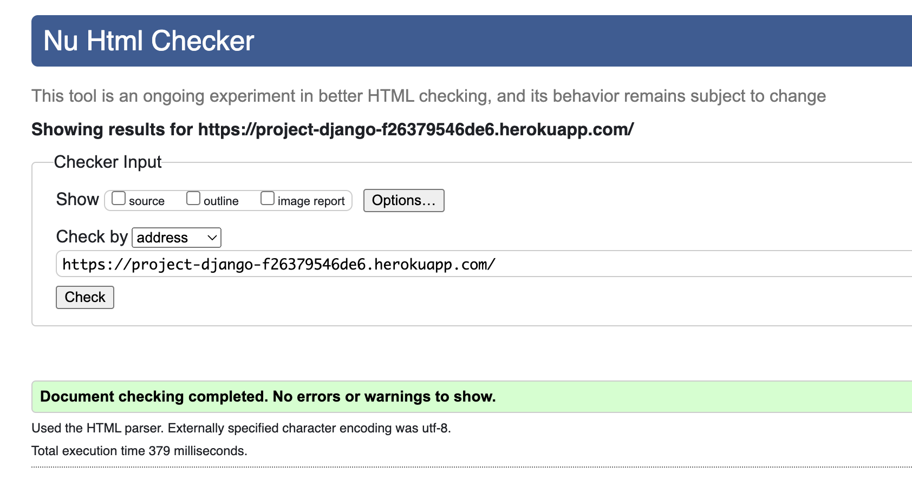
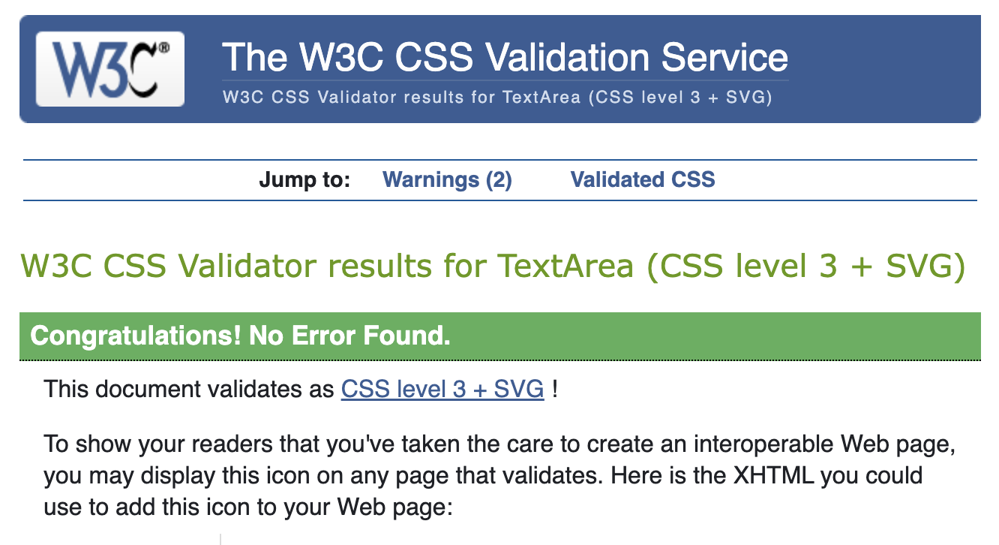
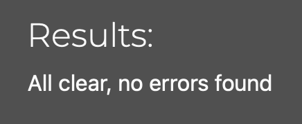
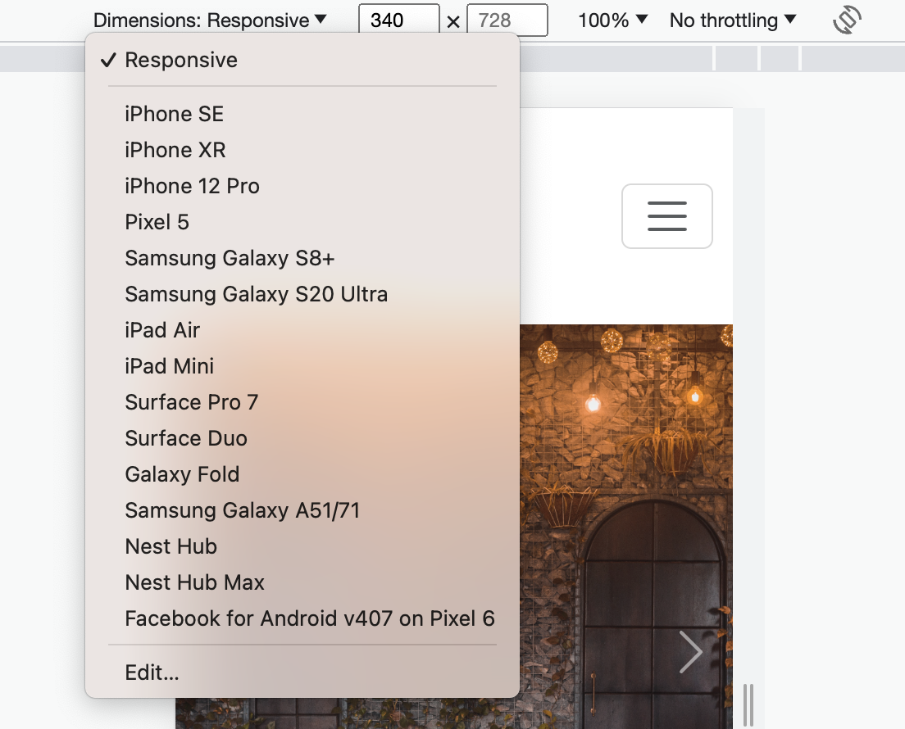
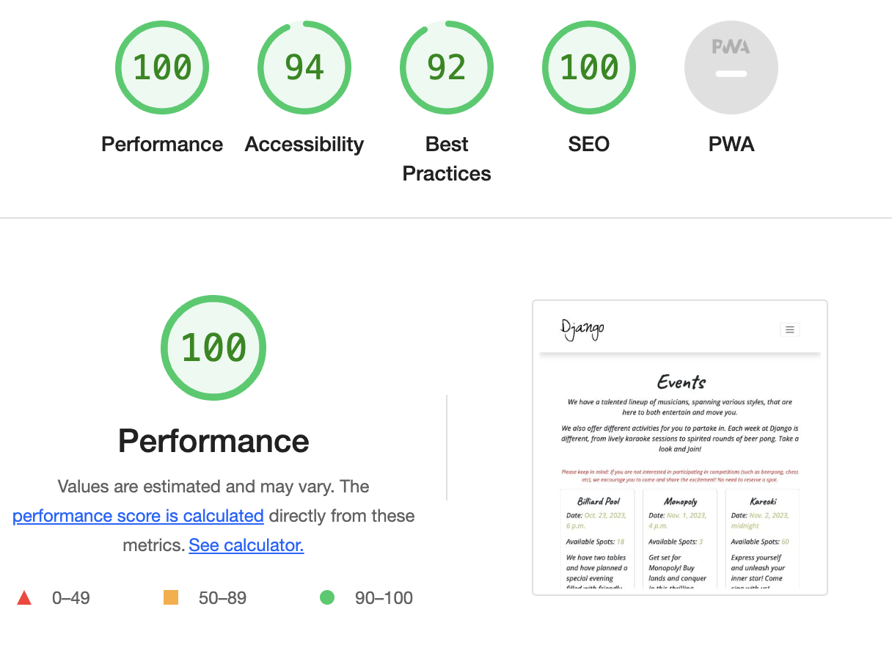

## Testing

### HTML

**HTML was validated at the official [W3C](https://validator.w3.org/) website and no errors were found.**

### CSS
**CSS was validated at the official [Jigsaw](https://jigsaw.w3.org/css-validator/) website and no errors were found.**

### Python
**Python code was checked at the official [Code Institute](https://pep8ci.herokuapp.com) pep8 validator and no errors were found.**

---

### Testing Events:

| Test | Steps | Expected Result | Tested | Passed |
| --- | --- | --- | --- | --- |
| Open "Events" page | Click on "Events" in the navbar. | The "Events" page should load, displaying a list of upcoming events with their names, dates, and available spots. | Yes | Yes |
| Reservation form | Choose an event and click the "Join The Fun" button. | A form should appear, displaying the name of the selected event, available spots, and an number box. | Yes | Yes |
| Maximum capacity safeguard | Insert a number higher than the available spots. | The submit button should be disabled. | Yes | Yes |
| Capacity accepted | Insert a number that is one less than the available spots (user counts as 1). | The submit button should be clickable. | Yes | Yes |
| Submit reservation | Click the submit button. | A success message should confirm the reservation. | Yes | Yes |
| Available spots left | Check if the available spots for the event have decreased from the initial available spots shown on the "Events" page. | The available spots should have subtracted the user + number of friends from the initial available spots. | Yes | Yes |
| Open "My Events" page | Click on "My Events" in the navbar. | The "My Events" page should load, displaying a list of upcoming reservations with event names, dates, and the number of friends the user is bringing. An Edit and Delete button should appear for each respective event. | Yes | Yes |
| Edit reservation | Click the "Edit" button. | A modal should appear, asking if the user is sure they want to edit their reservation. | Yes | Yes |
| "Edit" modal redirection | Click "Edit" button in the modal | The user is directed to the event they want to modify. | Yes | Yes |
| Edit success message | After editing, verify that a success message is displayed. | A success message should confirm the edit. | Yes | Yes |
| Available spots updated (edit) | Navigate to the "Events" page and check if the edited reservation for the event reflects in the updated available spots. | The available spots number should have (increased or decreased) accordingly. | Yes | Yes |
| Cancel reservation | Click the "Delete" button. | A modal should appear, asking if the user is sure they want to cancel their reservation. | Yes | Yes |
| "Cancel" action | Click "Cancel" in the modal | The user's reservation is deleted from database and can not be find in "my events". | Yes | Yes |
| Cancellation success message | After cancellation, verify that a success message is displayed. | A success message should confirm the cancellation. | Yes | Yes |
| Available spots updated (cancel) | Navigate to the "Events" page and check if the reservation cancellation for the event reflects in the updated available spots. | The available spots number should have increased accordingly. | Yes | Yes |
---

### Testing Reviews:

| Test | Steps | Expected Result | Tested | Passed |
| ---- | ----- | --------------- | ------ | ------ |
| Open "Reviews" page | Click on "Reviews" in the navbar. | The reviews page should load, displaying a list of user reviews with usernames, review text, and published dates. | Yes | Yes |
| Write a review | Click on "Write a Review." | The user should be redirected to a form with a textbox. | Yes | Yes |
| Post a review | Click "Submit" after writing a review. | The user should be redirected to the Reviews page, and a success message should be displayed. | Yes | Yes |
| See Review | On the "Reviews" page, check for the review. | The review should be displayed with the text written in the form. | Yes | Yes |
| Edit a review | Navigate to a review written by the same user who is currently logged in and click edit. | The user should be redirected to the edit review template. | Yes | Yes |
| Edit review template | After being redirected from clicking the button to the edit template; | The textbox should be prepopulated with the previously written review text. | Yes | Yes |
| Edit review submit | Click on the "Submit" button and check for the review. | The old review should be updated with the newly edited text. | Yes | Yes |
| Success message (edit) | After editing, verify the displayed success message. | A success message should confirm that the edited version was successfully submitted. | Yes | Yes |
| Delete a review | Navigate to a review written by the same user who is currently logged in and click delete. | The review should be deleted. | Yes | Yes |
| Success message (delete) | After deletion, verify the displayed success message. | A success message should confirm the deletion of the review. | Yes | Yes |
---

### Testing authentication:
| Test | Steps | Expected Result | Tested | Passed |
| ---- | ----- | --------------- | ------ | ------ |
| Access "My Events" without logging in | Try to access the "My Events" page without logging in. | Not a available navbar item for not authenticated users. | Yes | Yes |
| Access "Reservation form" without logging in | Try to access the reservation form (through the "Join The Fun" button) without logging in. | User should be redirected to the login page. | Yes | Yes |
| Access "Edit Reservation" without logging in | Try to access the "Edit" on a reservation without logging in. | User should be redirected to the login page. | Yes | Yes |
| Access "Delete Reservation" without logging in | Try to access the "Delete" on a reservation without logging in. | User should be redirected to the login page. | Yes | Yes |
| Access Review form without logging in | Try to access the "Write a Review" without logging in. | Users who are not logged in do not have the "Write a review" button, but a "Please login" link. | Yes | Yes |
| Access Edit Review form without logging in | Try to access the "Edit your Review" page without logging in. | Users who are not logged in do not have the "Edit" button. | Yes | Yes |
| Access Delete Review without logging in | Try to access the deletion without logging in. | Users who are not logged in do not have the "Delete" button available. | Yes | Yes |
| Login with valid credentials | Enter valid username and password and click "Login" button. | User should be redirected to the main page with authenticated access. | Yes | Yes |
| Login with invalid credentials | Enter invalid username and password and click "Login" button. | User should remain on the login page with an error message displayed. | Yes | Yes |
| Info message (invalid credentials) | After submitting invalid credentials, verify the displayed info message. | A info message should confirm that the edited version was successfully submitted. | Yes | Yes |
| Login and access "My Events" | Log in and click on "My Events" in the navbar. | The "My Events" page should load with a list of upcoming reservations. | Yes | Yes |
| Login and access "Join The Fun" | Log in and click on "Join The Fun" button on an event. | The reservation form should appear, allowing the user to insert the number of spots. | Yes | Yes |
| Login and access "Write a Review" | Log in and click on "Write a Review" button. | The user should be redirected to the review form. | Yes | Yes |
| Logout after logging in | Log in and click "Logout" button. | User should be redirected to the main page with non-authenticated access. | Yes | Yes |

**Important Note:**
As a non-authenticated user, I attempted to access various pages and features that are intended only for certain users or authenticated users, using direct URL inputs. During these tests, I was promptly redirected to the login page, ensuring security.

---

### Testing responsiveness

**I tested all pages on the website using [Google Dev Tools](https://developer.chrome.com/docs/devtools/) by dragging the viewport back and forth and by simulating different built-in devices. This process provided valuable insights during development, which led me to implement specific styling choices to ensure a seamless user experience across all devices.**

---

### Testing accessibility and performance
**I tested all pages on the website using [Google Lighthouse](https://chrome.google.com/webstore/detail/lighthouse/blipmdconlkpinefehnmjammfjpmpbjk?hl=sv) to make sure that the website is performing well and that it is accessible.**

---